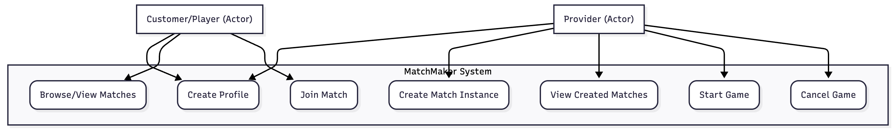
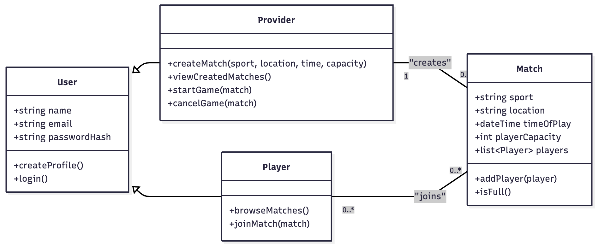
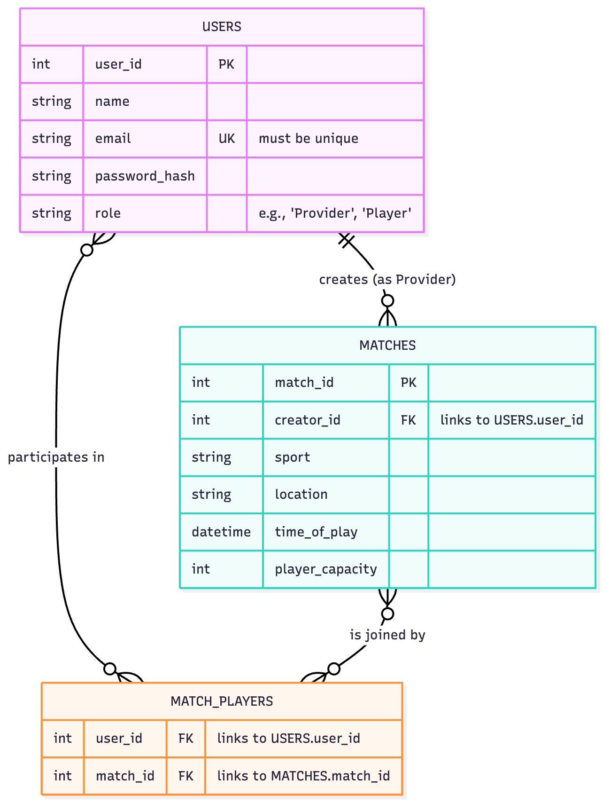

# Match Maker - Software Design

Version 1  
Prepared by Ahmed Omar Eltai & Keith Lonon
Match Maker
Oct 21, 2025

Table of Contents
=================
* [Revision History](#revision-history)
* 1 [Product Overview](#1-product-overview)
* 2 [Use Cases](#2-use-cases)
  * 2.1 [Use Case Model](#21-use-case-model)
  * 2.2 [Use Case Descriptions](#22-use-case-descriptions)
    * 2.2.1 [Actor: Provider (Ahmed Omar)](#221-actor-provider-author-ahmed-omar)
    * 2.2.2 [Actor: Customer/Player (Keith Lonon)](#222-actor-customerplayer-author-keith-lonon)
* 3 [UML Class Diagram](#3-uml-class-diagram)
* 4 [Database Schema](#4-database-schema)

## Revision History
| Name | Date | Reason For Changes | Version |
| ---- | ------- | ------------------- | --------- |
| Ahmed Omar | 10/21/2025 | Initial Design | 1 |
| | | | |
| Keith Lonon | 10/21/2025| Initial Design | 1 |
| | | | |

## 1. Product Overview
[cite_start]Match Maker is a web-based application designed to facilitate the creation and organization of pick-up sports matches[cite: 9], specifically for soccer or basketball. The motivation behind the app is a shared passion for recreational sports and the difficulty of organizing games. [cite_start]The application allows users to create, join, and manage matches for various sports at different locations and times. [cite: 10] [cite_start]The goal is to make it easy for individuals to find and participate in local sports activities, promoting community engagement and healthy lifestyles. [cite: 11]

## 2. Use Cases
### 2.1 Use Case Model

### 2.2 Use Case Descriptions

#### 2.2.1 Actor: Provider (Author: Keith Lonon)
the provider has the ability to select what sport they want to start a game for and also the time it takes place

##### 2.2.1.1 Create Profile
All users must create a profile with their name and email. All profiles have the ability to either join or create a game instance.

##### 2.2.1.2 Create Game Instance
[cite_start]The system shall allow a provider to create a new pick-up match[cite: 25]. [cite_start]They are responsible for specifying the sport, location, player capacity, and time of play for each match. [cite: 22] [cite_start]The system shall require all fields (sport, location, player capacity, time) to be filled before a match can be created. [cite: 26] The provider will be responsible for choosing pre-determined locations and time slots.

##### 2.2.1.3 View Created Matches
[cite_start]The system shall allow providers to view a list of matches they have created. [cite: 28] [cite_start]The system shall display a confirmation to the provider after successfully creating a match. [cite: 27]

#### 2.2.2 Actor: Customer/Player (Author: Ahmed Omar)
[cite_start]Customers/players are users who can join pick-up matches[cite: 23].

##### 2.2.2.1 Create/Modify Profile
A user registers by opening the app and filling in required slots for their name and email.

##### 2.2.2.2 View/Browse Available Games
Once registered, the user can select a sport (soccer/basketball), which will display locations and time slots with an option to start or join a game.

##### 2.2.2.3 Join Game
When joining a game, the user can pick between locations and see the current number of players, the player cap, and choose which team to join.

##### 2.2.2.4 Start Game
If a user hits "start a game," they get a display screen showing locations where they can select a time and set the number of players per team.

##### 2.2.2.5 Cancel Game
[cite_start]Players can cancel games if they no longer want that time slot. [cite: 24]

##### 2.2.2.6 Subscribe to Services
The user can subscribe to play on a competitive basketball court, which includes a leaderboard that ranks players.

## 3. UML Class Diagram

## 4. Database Schema

